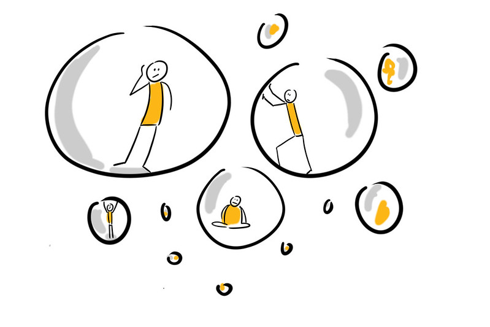

## Cultivate a PLN

A personal learning network, although often emergent and continually developing, does not just happen. It requires cultivation. To begin your thinking on how to cultivate your PLN, read [Howard Rheingold’s Advice on Building a PLN](https://docs.google.com/document/d/1ifJB_jjFGI3-PY-F8w1pbFZHmNlqDYY9TbKLNT15QX4/edit).

### Extend Activity #3
#### Cultivate your PLN
> This activity requires you to now “extend” your PLN and find new groups or individuals to connect with.
>
> Visit the [Cultivate Your PLN activity](https://elearn.waikato.ac.nz/mod/forum/view.php?id=1641382) in the Activity Bank for full instructions and the activity bank submission link.

[Take it to the Bank!](https://elearn.waikato.ac.nz/mod/forum/view.php?id=1641382 ":class=button")

* * *

**Remember to:**

*   Strengthen your connections. Comment on and share the work of others and contribute your own work or ideas. Gather and follow the people and organizations that push you to extend your thinking and move out of your comfort zone. Challenge yourself to find diverse voices that may inspire your thinking in new ways. That is key to creating a sustainable PLN—one that will help you develop and feel inspired
*   Limit your ‘follows’ to topics you are passionate about. Cull your follows once in a while to refocus your stream.
*   Always use “netiquette”; acknowledge the contributions of others.
*   Think before you share; be consistent with the identity you are projecting

* * *

### Beware of filter bubbles

The term “filter bubbles” was coined by Eli Parser. Read the [Wikipedia article about Filter Bubbles](https://en.wikipedia.org/wiki/Filter_bubble) or take a look at his TED Talk, [Beware of Online Filter Bubbles](https://www.ted.com/talks/eli_pariser_beware_online_filter_bubbles) (TED2011) perhaps even more relevant now.

It is important to follow and connect with a variety of people and organizations. Because you will choose who you want to follow—usually like-minded individuals—social media can give you an unbalanced view. It is important to seek out new perspectives to expand your own views and re-think your assumptions. Doing so will make your PLN more diverse and will challenge your thinking.

In their book [The Power of Pull: How Smart Moves, Smartly Made, Can Set Big Things in Motion](https://www.amazon.ca/Power-Pull-Smartly-Things-Motion/dp/0465028764), by John Haagel, John Brown, and Lang Davison stress the importance of reaching outside your usual areas of interest and expertise. Doing so will stretch you and help you avoid the insularity that can come from too much time spent in your own milieu, with only those who share your own interests.

* * *

Building your PLN
-----------------

There are tools (see the [Extend Toolkit](https://toolkit.ecampusontario.ca/)) and social media platforms that you might use to build your PLN. Leveraging the affordances of digital technologies means that the tools and activities you can engage with and use to build your learning network can take on vastly different forms. You might share something you have authored within your network and get feedback on what you have done from a variety of perspectives. Or you might be inspired by a provocative blog post that someone else in your network has posted. Or you might put out a call for collaborators on a new project, or join a group discussion, or remix someone else’s work as a way of extending their ideas—and the conversation about it. While digital technologies are not required for these learning activities to happen, they enable you to engage with them in novel and more expansive ways.

You might seek out specific venues where you can build your PLN, like conferences, or you might join social media groups related to your discipline to get started.

Visit the Extend Community discussion board to share strategies that you have tried to cultivate and expand your PLN. Visit the Extend Community discussion board to share your thoughts!

[Take me to the discussion!](https://elearn.waikato.ac.nz/mod/forum/view.php?id=1626661 ":class=button")
