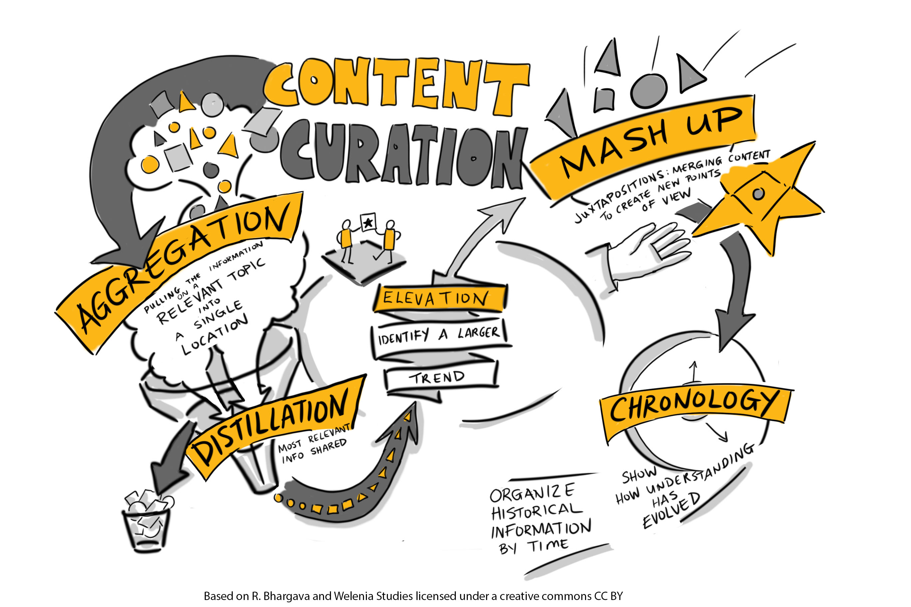

# Curation for Learning

Content curators provide a customized, vetted selection of the best and most relevant resources on a very specific topic.

Beth Kanter, a social media author and blogger, provides this definition of curation in her blog [Content Curation Primer](http://www.bethkanter.org/content-curation-101/):

“Content curation is the process of sorting through the vast amounts of content on the web and presenting it in a meaningful and organized way around a specific theme. The work involves sifting, sorting, arranging, and publishing information. A content curator cherry picks the best content that is important and relevant to share with their community. This is similar to what a museum curator does to produce an exhibition: They identify the theme, they provide the context, they decide which paintings to hang on the wall, how they should be annotated, and how they should be displayed for the public”.

If the notion of content curation is new to you, or if you want to brush up on your understanding of the concept, review the following references to learn more:

*   Two blogs about curating content, [Teacher As Curator](https://tedcurran.net/2014/02/11/teacher-as-curator-capture-organize-learning-materials-web-2-0-tools/) by Ted Curran and [Content Curation: How to Do It the Right Way (Plus Tips and Tools)](https://blog.hootsuite.com/beginners-guide-to-content-curation/) by Christina Newberry.
*   A resource from Columbia University on the importance of [selecting course content that recognizes diversity and acknowledges barriers to inclusion](https://ctl.columbia.edu/resources-and-technology/resources/inclusive-teaching-guide/principle-3/).
*   A video that answers the question [What is Content Curation?](https://youtu.be/8Qzgj7Mk8As) (Centerline Digital, 2015).

Examples of content curation tools include [Pocket](https://getpocket.com/), [Scoop.it](https://www.scoop.it/) and [diigo](https://www.diigo.com/) and see [more Curation tools in the Extend Toolkit](https://toolkit.ecampusontario.ca/module/curator/) to learn more about these tools and others.

A graphic view of content curation:

Each of these resources reveals that content curation likely aligns well to what you already do when you design and develop your courses to facilitate learning. Here, we simply reframe the process and identify tools and strategies to assist you along the way.

**Next you'll visit the Extend Community discussion board to identify your definition of content curation and why you think it might be important/useful.**

This work is licensed under a Creative Commons Attribution-NonCommercial-ShareAlike 4.0 International License

