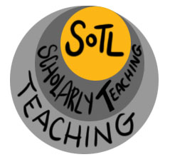

## The Value of SoTL

Many SoTL practitioners, publications, and journals list potential benefits of a proactive approach to classroom scholarship, some of which are articulated in **Making a Case for SoTL** (below). This video also makes a case for institutions to support those who are engaging in SoTL research.

<iframe width="560" height="315" src="https://www.youtube.com/embed/JlWM4K2WL3Q"></iframe>

Direct Link: [Making a Case for SoTL](https://youtu.be/JlWM4K2WL3Q)

* * *

### Extend Activity #2
#### Engage with SoTL
> In this activity think about what keeps you going, what are the top 3 things that motivate you. You will also review and add comments to the motivations contributed by other participants.
>
> Visit the [Engage with SoTL](https://elearn.waikato.ac.nz/mod/forum/view.php?id=1649875) activity in the Activity Bank for full instructions..

[Take it to the Bank!](https://elearn.waikato.ac.nz/mod/forum/view.php?id=1649875 ":class=button")
