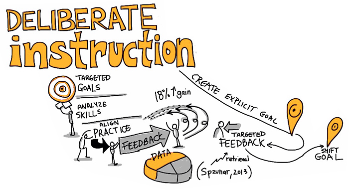

# Feedback and Practice

The principle of goal-directed practice and feedback refers to students needing numerous opportunities to work toward the goals that have been set and to receive explicit feedback. Feedback is most effective when it is provided at the right time for the learner. Often, we design our assessments at the end of the learning to measure the final product, and we do not provide sufficient opportunities to scaffold learners toward the goal. The latter is known as formative assessment and can be immensely beneficial to you as a teacher in determining if your learners are on track. It is even more important for your learners to discover for themselves about how well they are performing and how they can improve in particular areas.

## In-class strategies

Here are some strategies for applying formative assessments:

*   Use the “one-minute paper.” Ask your students to write on an index card (or the equivalent online document) what their most significant learning kernel was for a lab, module, or even a lecture.
*   When the goal is acquisition of factual knowledge, chunk your assessments into smaller, more frequent quizzes to allow students the opportunity of experiencing test-taking in a setting with lower stakes than the typical midterm exam.
*   When creating written assignments, consider designing the assessment to include draft revisions. This could be done by frequent writing activities in discussion board forums, creating an annotated bibliography, using mind maps, or asking for weekly reflections.

>Deliberate instruction is the act of always considering your desired outcome and intended learning for your students, and then working backwards in your lesson planning so that students can successfully achieve that goal. You cannot expect students to achieve the learning goals if you made the process of getting there both convoluted and unattainable.

 This work is licensed under a [Creative Commons Attribution-NonCommercial-ShareAlike 4.0 International License](https://creativecommons.org/licenses/by-nc-sa/4.0/).
