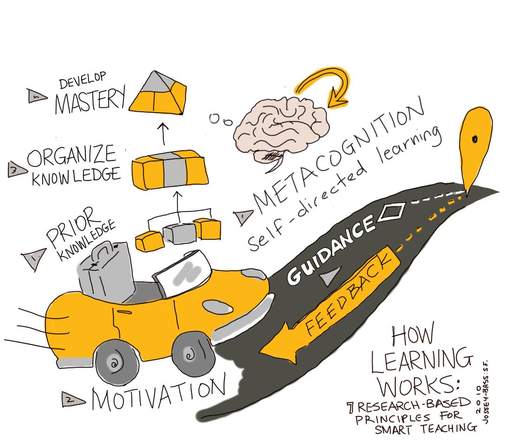

# How Learning Works <!-- {docsify-ignore} -->

This module is based primarily on the excellent book by Susan Ambrose and colleagues, [**How Learning Works: Seven Research-Based Principles for Smart Teaching**](https://waikato.primo.exlibrisgroup.com/permalink/64WAIKATO_INST/10hutka/alma9917428498803401) (2010).  
Jossey-Bass: San Francisco.

> _“Learning results from what the student does and thinks and only from what the student does and thinks. The teacher can advance learning only by influencing what the student does to learn.”_
> 
> – Herbert A Simon

The seven principles are:

*   Students’ **prior knowledge** can help or hinder learning.
*   How students **organize knowledge** influences how they learn and apply what they know.
*   Students’ **motivation** determines, directs, and sustains what they do to learn.
*   To develop **mastery,** students must acquire component skills, practice integrating them, and know when to apply what they have learned.
*   Goal-directed **practice** coupled with targeted **feedback** enhances the quality of students’ learning.
*   Students’ current level of **development** interacts with the social, emotional, and intellectual **climate** of the course to impact learning.
*   To become **self-directed learners,** students must learn to monitor and adjust their approaches to learning.

