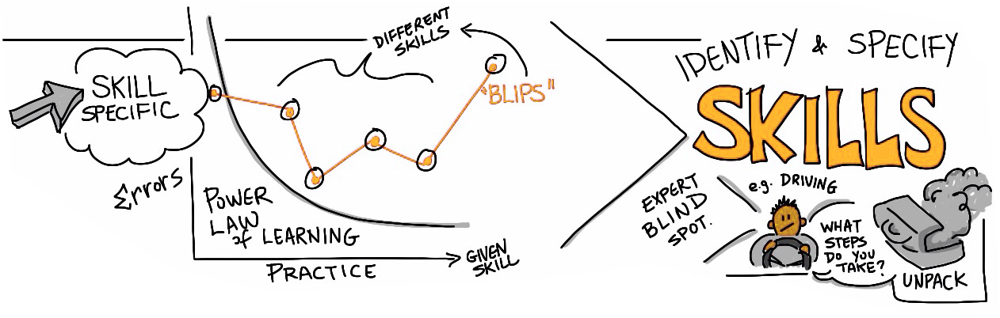

# Mastery

One of the most difficult aspects of deconstructing the skills and concepts associated with achieving mastery occurs when dealing with **“threshold concepts.”** These are often essential concepts in the discipline that must be understood in order to achieve mastery but are extremely challenging because once you fully understand them it is almost impossible to conceive of the topic without them. This is often described as an “expert blind spot.”

If you have an expert blind spot, it is difficult to break down the concept into its component parts because your thinking has been irrevocably transformed. It is our role as educators to try and remember what it is like to be a novice learner.

The book [Threshold Concepts and Transformational Learning](https://waikato.primo.exlibrisgroup.com/permalink/64WAIKATO_INST/10hutka/alma9917500433203401) addresses these concepts, as described by faculty with expertise in several disciplines ranging from economics to electrical engineering, modern languages to mathematics. The scope of these concepts is too great to detail in this module, but we can consider the simple example of learning how to drive a car.

To learn to drive, you require many component skills, including knowing where the gas and brake pedals are and when to use them, how to steer, when and how to use your mirrors, all while following the rules of the road. Experienced drivers find it very difficult to think of each component separately, not as a whole. They drive with a level of automaticity, knowing their reflexes will apply each component as needed.

Learning the component skills to achieve mastery is crucial in any discipline. For example, in economics, physics, or chemistry, the application of a formula can be more easily learned if simple calculations like addition and multiplication have first been mastered so that no cognitive overload occurs. Having the component skills in place allows the learner to focus on the larger conceptual problem.

---
### Extend Activity #5
#### Like Driving a Car
>
>What concept in your discipline is like driving a car? Identify and explain the component skills required to master this concept or skill.
>
>Visit the [Like Driving a Car activity](https://elearn.waikato.ac.nz/mod/forum/view.php?id=1601368) in the Activity Bank for full instructions.
>

[Take it to the Bank!](https://elearn.waikato.ac.nz/mod/forum/view.php?id=1601368 ':class=button')

***

 This work is licensed under a [Creative Commons Attribution-NonCommercial-ShareAlike 4.0 International License](https://creativecommons.org/licenses/by-nc-sa/4.0/).
