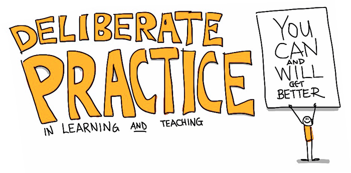
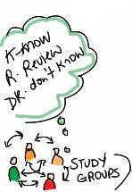

# Metacognition

Students need to assess the demands of the task, evaluate their own knowledge and skills, plan their progress, monitor their progress, and adjust their strategies as needed.

Self-directed learning and actively taking the time to reflect on one’s own learning is described as **metacognition.** Developing metacognitive skills through deliberate practice and embedded checkpoints fosters intellectual habits that are valuable for learning retention and across disciplines.

These checkpoints should occur at the beginning of the learning where students are encouraged to practice task assessment and planning. Metacognition should continue through the evaluation of the outcomes and adjust approaches accordingly.

A very important factor for developing this flexible mindset is rooted in students’ self-efficacy. It is extremely useful for instructors to stress the importance of developmental approaches so that they can fully appreciate that intelligence is not fixed.

* * *

## Strategies to promote metacognition

*   Be explicit; indicate what you do not want; provide performance criteria.
*   Provide opportunities to peer and self-assess; practice; and give feedback.
*   Ask your students whether the answer they provide is reasonable given the problem.

Here are some helpful prompts to ask your learners:

*   What do I already know about this topic?
*   How does this topic make me feel?
*   Does this topic relate to something I already know?
*   How can I apply this topic in another context?

One activity that can be done at the end of class is [Stephen Brookfield’s critical incident questionnaire (CIQ).](http://www.stephenbrookfield.com/critical-incident-questionnaire)

Other metacognitive strategies that lead to self-directed learners are [Note-taking](https://www.flickr.com/photos/gforsythe/5735684602/) ([see Organise Knowledge](organise-knowledge.md)), One Minute Paper ([see Feedback and Practice](feedback-and-practice.md)), Reflective Writing (nuggets), Exam Wrappers, and Retrospective Post-Assessment.

* * *

### Extend Activity #6
#### Thought Vectors
> This activity is taken from the [Thought Vectors in Concept Space syllabus](https://hcommons.org/deposits/item/hc:31139/) designed by Dr. Gardner Campbell for an undergraduate research and writing course at Virginia Commonwealth University.
>
>> Nuggets: Review [The Faculty Patchbook](https://openfacultypatchbook.org/), a collection of faculty authored overviews of specific pedagogical skills. Then select one article that resonates with you. Select a passage from the article that grabs you in some way and prepare to make that passage as meaningful as possible.
>
> Visit the [Thought Vectors activity](https://elearn.waikato.ac.nz/mod/forum/view.php?id=1601374) in the Activity Bank for full instructions.

[Take me to the bank!](https://elearn.waikato.ac.nz/mod/forum/view.php?id=1601374 ":class=button")

* * *

### Extend Activity #7
#### Your Metaphor
> Throughout this module we have explored various types of metaphors for teaching and learning.
>
> - **Prior learning, not prior experiences and contexts** were potential roadblocks.
>
> - **Motivation** was **drive**.
>
> - **Mastery and organisation of knowledge** are like component **building blocks** toward a cohesive structure.
>
> - **Self-direction and metacognition** are like our own **internal GPS** signaling our own personal wayfinding.
>
> Now it is time to put it together considering your own teaching philosophy.
>
>> _What is your metaphor for teaching and learning?_
>
> See some exercises for exploring your teaching philosophy and some metaphors for teaching from the University of Waterloo.
>
> Visit the [Your Metaphor activity](https://elearn.waikato.ac.nz/mod/forum/view.php?id=1593640) in the Activity Bank for full instructions.

[Take me to the bank!](https://elearn.waikato.ac.nz/mod/forum/view.php?id=1593640 ":class=button")
