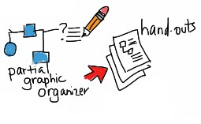
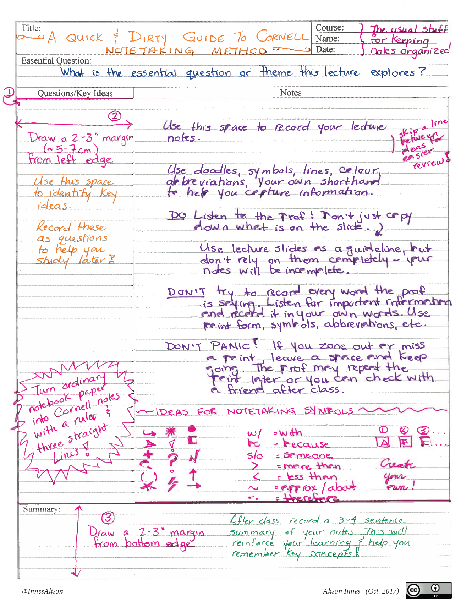
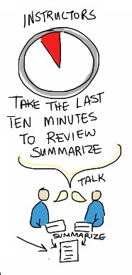

# Organise Knowledge

The way we present information and how we subsequently categorise new knowledge can make dramatic differences in our students’ learning. We can help learners to make sense of new information by being explicit about how we suggest information fits with prior knowledge.

### Activity <!-- {docsify-ignore} -->

**Play this game that shows how organisation matters**

(Modified from: [Fink, D. (2015, June 18). _Five high impact teaching practices_ [Keynote address]. STLHE, Vancouver](https://stlhe15.sched.com/event/3Yfs/keynote-02-5-high-impact-teaching-practices).)

**1. Look at the list of words and count all of the vowels.**

    
| Dollar bill          | Cat Lives          |
|:---------------------|:-------------------|
| **Dice**             | **Bowling Pins**   |
| **Tricycle**         | **Football Team**  |
| **Four-Leaf Clover** | **Dozen Eggs**     |
| **Hand**             | **Unlucky Friday** |
| **Six-Pack**         | **Valentine's Day**|
| **Seven-Up**         | **Quarter Hour**   |
| **Octopus**          |                    |

**2. How many vowels did you count?**

**3. How many words do you remember?**

This activity often generates a lot of groans. Participants want to succeed so much in the task assigned the first time that they barely pay any attention to the words themselves. When they are asked to shift and remember words, they are frustrated because they feel misled.

**4. Now look at the words again.**

Did you notice the pattern of organisation: that each word is associated with a number?

**5. Try the game again.**

How many words did you remember this time?

> Most people remember more words the second time that they play the game. There are three reasons for this.
>
> 1.  They knew what the real task was by being provided the criteria for success.
> 2.  The information was organised in a way to aid memory.
> 3.  They were given more than one opportunity to practice remembering to stimulate the recall of previously acquired information.
>
> This simple game covers a great deal of the seven evidence-based principles for learning that are discussed in this module.

## Strategies for Organising Information <!-- {docsify-ignore} -->

### 1. Consider Universal Design for Learning

Universal Design for Learning acknowledges that there is great variation in how individuals learn. Two major points of Universal Design for Learning:

 Learning should be designed to be accessible to everyone of all intersections of identity. Information should be conveyed in a variety of ways, known as “multiple means of representation.” For example, instead of using just a wall of text, consider adding some visual elements. If you do add an image you should explain it using the description tag available online. Sometimes a video is the best way to explain something, but if you use video, be sure to always include transcripts and captioning. (The information about [Universal Design for Learning](http://www.cast.org/impact/universal-design-for-learning-udl) goes into great depth about this.

***

### 2. Mind Mapping

Mind mapping has been found to be an effective means of helping students organise new learning while reinforcing previous learning and improving information retrieval. Some studies have found that using mind mapping as a learning [strategy facilitates memory and critical thinking.](https://bmcmededuc.biomedcentral.com/track/pdf/10.1186/1472-6920-10-61)

If you are still not convinced, check out [The Theory Underlying Concept Maps and How to Construct and Use Them.](http://cmap.ihmc.us/Publications/ResearchPapers/TheoryUnderlyingConceptMaps.pdf)

Keep in mind that mind maps are not just good for students, they are great for teachers too. When planning your course, you could use a mind map to decide what content to include and how they are connected. You could then share it with your students, so they can get an overview of how you see your course fitting together. Using mind maps to outline your course syllabus not only models how to organise information but also adheres to the universal design principles of conveying information in multiple modes, according to Biktimirov & Nilson, 2006 in [Show Them the Money: Using Mind Mapping in the Introductory Finance Course](https://papers.ssrn.com/sol3/papers.cfm?abstract_id=2467958).

---
### Extend Activity #2
#### Syllabus Concept Map
>
>Using [MindMup](https://www.mindmup.com/) or another [visual organiser tool in the Extend Toolkit](https://toolkit.ecampusontario.ca/family/visual-organizer/), create a concept map of your course syllabus.
>
>Visit the [Syllabus Concept Map activity](https://elearn.waikato.ac.nz/mod/forum/view.php?id=1595143) for full instructions.
>
  
[Take it to the Bank!](https://elearn.waikato.ac.nz/mod/forum/view.php?id=1595143 ':class=button')

***

### 3. Offer a partial graphic organiser

Instead of providing your complete lecture notes on the LMS, consider offering a partial graphic organiser (see [Visual Organiser Tools in the Extend Toolkit](https://toolkit.ecampusontario.ca/family/visual-organizer/)) that highlights some of the key learning. This creates high impact learning as students can actively participate in their learning, especially if you prompt them to record in important facts to create the full picture. This practice should also help to ensure attendance remains high. [In Increasing Text Comprehension and Graphic Note Taking Using a Partial Graphic Organiser](https://doi.org/10.3200/JOER.100.2.103-111), Robinson et al (2006) describes how using partial graphic organisers can aid in learning.

***

### 4. Provide opportunities for better notetaking

<iframe width="780" height="585" src="https://www.youtube.com/embed/WtW9IyE04OQ"></iframe>

Direct Link: [How to Take Cornell Notes](https://youtu.be/WtW9IyE04OQ)

  

1.  Split your page so that it looks like Cornell notes.
2.  Take notes that make sense to you in the right-hand (two-thirds) space.
3.  When you are done, use two different colour markers to highlight key points and new or specialised vocabulary. Use the left-hand (one-third) space to rewrite those key points and vocabulary with explanatory text.

[Download a PDF](https://alisoninnes.files.wordpress.com/2017/10/cornell-notes-quick-dirty-guide.pdf) version of these Cornell Notes.

---
### Extend Activity #3
#### Cornell Notes
>
>Watch a TED Talk or conference keynote video to practice your own note taking skills using Cornell Notes.
>
>Visit the [Cornell Notes activity](https://elearn.waikato.ac.nz/mod/forum/view.php?id=1597313) for full instructions.
>

[Take it to the Bank!](https://elearn.waikato.ac.nz/mod/forum/view.php?id=1597313 ':class=button')

***

### 5. Allow time to process

If we want our students to succeed it is ideal to model successful behaviours that have been shown to be beneficial to learning.

It is widely known that students who take the time to review their notes do much better than students who do not. It is important to note that for many marginalised students, time in the classroom is the only space they have to fully dedicate to understanding concepts. With that in mind, use the last 10 minutes of your lecture time to allow students to process what was just covered. Doing so has two main benefits: it encourages you to think about the main learning you hope to cover during your lecture, and it allows students to immediately retrieve, use, discuss, and question what they have just learned. Invariably, they can also discard confidently held misinformation in doing this.

You can follow this pattern to organise the 10-minute processing time, allowing about two minutes for each step:

**Select each item to learn more.**

  
Step 1

Ask your students what they think would be a good exam question based on the lecture they just heard.

  
Step 2

Ask your students to flip their page over and draw a picture that represents a key idea related to this “good exam question.”

  
  
Step 3

Have your students turn to a neighbour and share their Cornell notes.

  
Step 4

Ask them to compare their proposed exam questions and drawings. Can they answer each other’s questions? Do the drawings make sense to each other?

  
Step 5

You will find that structuring the end of your lecture in this way is more effective than simply asking the students, “Do you have any questions?” Students often interpret that question as a signal that it is time to pack up their laptops and belongings. In contrast, the summarising time and activities makes the students’ thinking visible and provides an immediate opportunity for students to confront any misconceptions.

>
>_**Do you have any successful tips/techniques/best practices to share with regard to how you typically end your lectures? Or if you do not teach, perhaps successful ways to end a presentation?**_
>
>Visit the discussion forum to share your thoughts!
>
  
[Take me to the discussion!](https://elearn.waikato.ac.nz/mod/forum/view.php?id=1626677 ':class=button')

 This work is licensed under a [Creative Commons Attribution-NonCommercial-ShareAlike 4.0 International License](https://creativecommons.org/licenses/by-nc-sa/4.0/).
