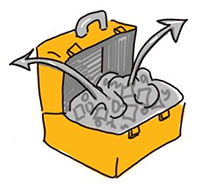

# Prior Knowledge

We know that without a doubt that the single most important attribute that your students bring to class is their prior learning and experience. Students will come to learning from a multitude of experiences which will be important to consider in your pedagogy. This knowledge can either contain essential building blocks to advance toward mastery or be a heavy weight that slows down and impedes learning.

* * *

## Prior knowledge can help or hinder learning

**_Help_**: Using students’ own experiences to generate examples helps learners to make connections and increase retention and overall knowledge acquisition. Examples include scaffolding learning from earlier classes and experiences.

**_Hinder_**: Insufficient, inaccurate, or incorrect information can slow or halt learning. For example, you may have heard of the famous physics education study where scientific misconceptions persist even in [Harvard graduates](https://www.learner.org/series/a-private-universe/1-a-private-universe/) about why we have seasons or whether a feather dropped from a specific height would fall slower than an anvil that is dropped from the same height. Even after having learned and been tested, students persist on reverting back to “intuitive” stances about scientific misconceptions, which ultimately can hinder any potential learning that would need to scaffold onto these basic grade school principles and concepts.

* * *

## Strategies to determine and acknowledge students’ prior knowledge

You can identify some common misconceptions in your discipline by considering your student’s prior learning and connecting new knowledge to prior knowledge.

#### Determine your students’ prior learning

*   Use diagnostic assessments such as self and peer assessments, brainstorming, and mind maps. Look for patterns amongst the students’ responses.
*   Allow space, without pressure, for students to self-identify during these assessments. What they tell you about where they are coming from will be important for your pedagogy.

#### Connect new knowledge to prior knowledge

*   Be explicit about connections.
*   Link between courses.
*   Links within courses.
*   Links to other disciplines.
*   Links to students’ own knowledge and experience.

* * *
Visit the discussion forum to identify a concept that is often misunderstood in your discipline. Explain why the concept is important and what the impact/effect is of not understanding this concept.

[Take me to the discussion!](https://elearn.waikato.ac.nz/mod/forum/view.php?id=1626662 ":class=button")

* * *

### Extend Activity #1
#### Misunderstood
> “Extend” your thinking on this misunderstood concept. Can you think of an analogy that can help make the concept make sense to students?
>
> - Does this analogy take into account where students are coming from in their previous experiences?
> - Or how could you break that concept down into bite-size chunks so your students can more easily digest that harder-to-acquire information?
>
> For this activity you will re-state your misunderstood concept and then identify and expand on how you would explain your concept through an analogy by responding to the [Misunderstood activity](https://elearn.waikato.ac.nz/mod/forum/view.php?id=1593750).

[Take me to the bank!](https://elearn.waikato.ac.nz/mod/forum/view.php?id=1593750 ":class=button")
