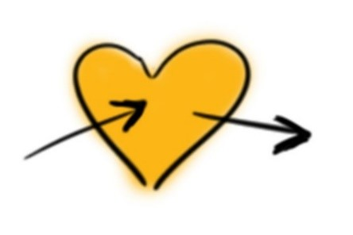
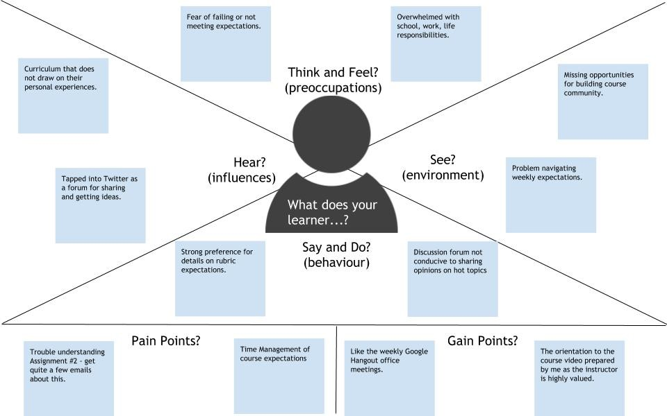

## Empathise with your learners

Design thinking starts with empathy. When you design something that is going to be used by someone else—for a lecture, an activity, an assessment—you must first understand what that person needs. For example, when architects design a building, they put aside their own desires and think about what the users of that building need.

* * *

### Extend Activity #1
#### Empathy Map
>
> In this activity you will imagine yourself as one of your learners and create an empathy map. Start by accessing the template and save a copy of the template to your Google Drive or click **File > Download** to save a copy to your computer.
>
> Start thinking about how you can gather information from and about your learners, what your learners think, feel, hear, say, etc. and complete the fields in the worksheet. What does an empathy map look like? Here is [an example](https://docs.google.com/drawings/d/1P4zUuZjbPqI1B2dLOtuVUltV0e433IgJu8gAz4LLamo/edit) that you can download and refer to as you create your own!

* * *

* * *

> Visit the [Activity Bank Empathy Map](https://elearn.waikato.ac.nz/mod/forum/view.php?id=1649795) activity for full instructions and the activity bank submission link.

[Take it to the Bank!](https://elearn.waikato.ac.nz/mod/forum/view.php?id=1649795 ":class=button")

* * *

After your Empathy Map is complete, try to get additional feedback in one of the following ways:

1.  Seek out a colleague within your department/discipline area to discuss with your empathy map with them. See if there are shared concerns, or perhaps strategies they might suggest that you have not considered.
2.  Circle back to your learners to make sure what you have captured accurately reflects their experience. This could involve an informal conversation with one or more of the learners you gathered the information from.
