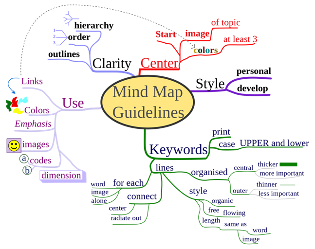
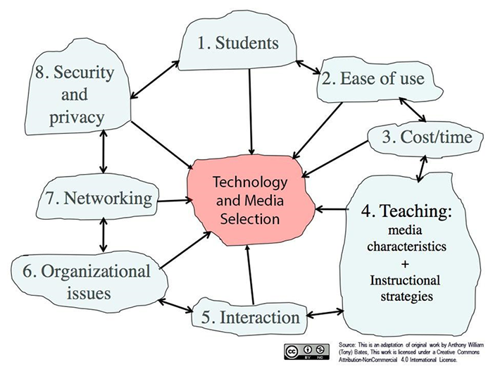

## Ideate

Now it is time to ideate: to form and build the ideal features and characteristics of how using a technology could address your learner challenge. The best way to approach this is to build a list of possibilities by asking yourself, “How might I?”

We suggest you do this by [mind mapping](https://en.wikipedia.org/wiki/Mind_map). You can use our [Learner Challenge Mindmap Doc](https://docs.google.com/drawings/d/1yjatND1ce96r0PIXbmz4ykPm1tJUyIRzme6DyFAzw6I/edit) or another online mind mapping tool such as [Mindmeister](https://sandbox.ecampusontario.ca/item/mindmeister), [MindMup](https://sandbox.ecampusontario.ca/item/mindmup), [Coggle](https://sandbox.ecampusontario.ca/item/coggle), [Canva](https://sandbox.ecampusontario.ca/item/canva). Other tools you might consider using to ideate are [Padlet](https://sandbox.ecampusontario.ca/item/padlet) and [Prezi](https://sandbox.ecampusontario.ca/item/prezi). Refer to the [EdTech Sandbox](https://sandbox.ecampusontario.ca/browse?ontarioextend=collaborator&ontarioextend=curator&ontarioextend=experimenter&ontarioextend=scholar&ontarioextend=teacher-for-learning&ontarioextend=technologist) for further information regarding these tools.

[Example of Learner Challenge Mindmap](https://docs.google.com/drawings/d/1vgI3vIuIBN61JVHTGN5_ff8n2g5bB3aExYvaPanBfNM/edit?usp=sharing)

_“_[MindMap Guidelines](https://commons.wikimedia.org/wiki/File%3AMindMapGuidlines.svg)_” by Nicoguaro is licensed under_ [CC-BY-SA](https://creativecommons.org/licenses/by-sa/3.0/deed.en)

* * *

### 1. Choosing a Technology Tool

Next comes the work of selecting a technology to help you build an activity or resource that will help you address the challenges your learners are having in understanding a concept, or any other challenge you have identified.

Keep in mind that lack of access to a reliable internet connection may be a barrier for students. Be careful about technology that requires high bandwidth such as video-streaming or software/apps that require even a small fee.

When searching for technology tools, you can start by looking at the list of common tools and approaches in this [“How To’s section”](https://extend.ecampusontario.ca/the-how-tos/) which walks users through a DIY approach to common tool integration.

You may also want to look at [The Centre for Learning and Performance Technologies Tool Directory](http://c4lpt.co.uk/) which contains over 1,000 entries categorized in four main areas. Look for the [Top 100 Tools for Learning 2021](https://www.toptools4learning.com/) . The [Common Sense Education Digital Tools](https://www.commonsense.org/education/selections-for-learning), geared toward K-12, is also a handy resource for all educators and includes the ability to filter searches by a variety of criteria. For resources on accessible learning, refer to great resource on [20 Tips for Teaching an Accessible Online Course](https://www.washington.edu/doit/20-tips-teaching-accessible-online-course).

Take some time to check these sites out and consider which could fulfill the requirements you have identified as your learner challenge, in your leaner challenge mind map. (Note: This can take time as you may find yourself down the Internet rabbit hole!)

You may find it helpful to use the metacognitive technique called "Think Aloud" as you investigate various tools. With this technique, you literally think out loud and record your thoughts as you explore (e.g., "The interface is nicely designed, but I don't see the ability for peer comments, and that’s an important feature I'll need."). Recording your thoughts by using a microphone and software like [Audacity](https://www.audacityteam.org/) allows you to focus on exploring the tool without interrupting your thinking by taking notes.

Ideally, you already had a tool in mind, and find that it fulfills all of your, and your learner’s needs. Or, it may take more time and some trial and error before you find a tool that is suitable. Do not get disheartened – refer to the sites referenced in this section earlier for inspiration.

* * *

### 2. Using the SECTIONS Model to Evaluate a Tool

Now that you have selected the technology that you will integrate into your teaching and learning, it is good practice to assess its fit beyond your learner challenge definition, to include other factors around support requirements. A helpful framework to guide this assessment is the SECTIONS model, developed by Tony Bates and shown here. It is one of many frameworks that can help you make effective decisions about the choice and use of technology (and media) for teaching and learning.

It is important to note that while the design thinking around technology integration is learner-focused, it is also important to ensure that the tool you have selected is a good fit for your students, course, program and institution and the SECTIONS model can help with this.

“[The SECTIONS Model](https://opentextbc.ca/teachinginadigitalage/chapter/9-1-models-for-media-selection/)” by Anthony William Bates is licensed under [CC-BY-NC](https://creativecommons.org/licenses/by-nc/4.0/)

*   Explore [Chapter 8 of the open textbook Teaching in a Digital Age,](https://opentextbc.ca/teachinginadigitalage/part/9-pedagogical-differences-between-media/) by the SECTIONS developer and author Dr. Tony Bates, provides a full description of the model.
*   Review a [SECTIONS planning framework out of UBC](https://wiki.ubc.ca/images/1/19/SECTIONS_Framework.pdf) which may help provide additional details and guidance on its use.

After you have read a bit about the model, try your hand at the following quizlet by matching the criteria to their definition and scope.

[Try the quiz!](https://quizlet.com/216075686/match ":class=button")

* * *

### Extend Activity #3
#### Using the SECTIONS Model to Evaluate a Tool
>
> Map your chosen technology to the SECTIONS H5P model through our aptly-named [“Map your technology to the SECTIONS model”](https://h5p.org/node/100161) exercise.
>
> Once you have completed all of the steps, choose the “Export Text” button to save your work as a Microsoft Word file.
>
> Visit the [Using the SECTIONS Model to Evaluate a Tool](https://elearn.waikato.ac.nz/mod/forum/view.php?id=1649794) activity for full instructions and and the activity bank submission link.

[Take it to the Bank!](https://elearn.waikato.ac.nz/mod/forum/view.php?id=1649794 ":class=button")

* * *

### 3. Refine your idea

Based on your consideration of the SECTIONS model, you may need to refine the ideas you have formed around your planned technology use. Take time to do so before moving on to the prototyping step.

### Extend Activity #4
#### Learner Challenge Take 2
>
> After you have selected your technology, revisit our Padlet and your earlier post that described your challenge.
>
> Visit the [Learner Challenge Take 2](https://elearn.waikato.ac.nz/mod/forum/view.php?id=1649784) activity for full instructions and the Activity Bank submission link.

[Take it to the Bank!](https://elearn.waikato.ac.nz/mod/forum/view.php?id=1649784 ":class=button")
