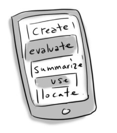

## Iterate and Connect

### 1. Refine

Based on their responses, you can now take the necessary steps to synthesize that feedback in order to refine your technology-enabled learning activity creation. It is important to recognize that often it is not practical or beneficial to fix every perceived user issue. You might want to take the feedback received, and prioritize it based on feasibility and how it works, to evolve the best solution for your learner challenge.

* * *

### 2. Connect to Your Professional Practice

This exercise has you thinking about how you will integrate technology into your professional practice, now it is time to think about how you will, ‘integrate this integration’. Just as an architect would envision users of a new building walking through it, you need to craft an implementation plan as to how your learners will progress through your tech creation as an activity technology-enabled learning activity.

You might want to storyboard the process or create a checklist. Either way, map and clearly sequence the instructions you will give your learners. Make sure to indicate how the different elements fit together and link the activity to your learning outcomes. If you get to this point and cannot connect your technology creation/activity back to your course learning outcomes, it is cause for attention.

* * *

### Extend Activity #6
#### It's Alive!
> Congratulations! You’ve made it to the final step in the Design Thinking Process and will now begin creating your prototype!
>
> Once you have created your masterpiece, it’s time to share! You will post an explanation of the context and reasons why you choose to use a technology-enabled solution for your learning challenge to the [It’s Alive! activity](https://elearn.waikato.ac.nz/mod/forum/view.php?id=1649801). Your response should include your process for empathizing and defining your learner challenge, the steps you took in ideating and prototyping your technology creation as well as your planned implementation.
>
> Visit the [It’s Alive activity](https://elearn.waikato.ac.nz/mod/forum/view.php?id=1649801) for full instructions and the Activity Bank submission link.

[Take it to the Bank!](https://elearn.waikato.ac.nz/mod/forum/view.php?id=1649801 ":class=button")

* * *

### Check your Knowledge on the Design Thinking Process

Before or after you dive into this final Extend Activity, check your knowledge of the design thinking process by dragging the correct description on to each phase of the design thinking process.

<iframe width="560" height="315" src="https://harlows.github.io/design-thinking-drag-and-drop.html" style="border:none;"></iframe>
